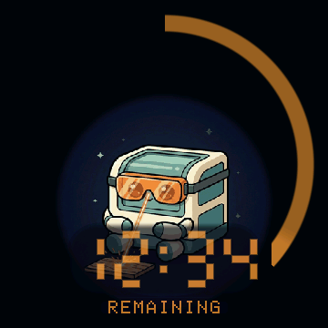
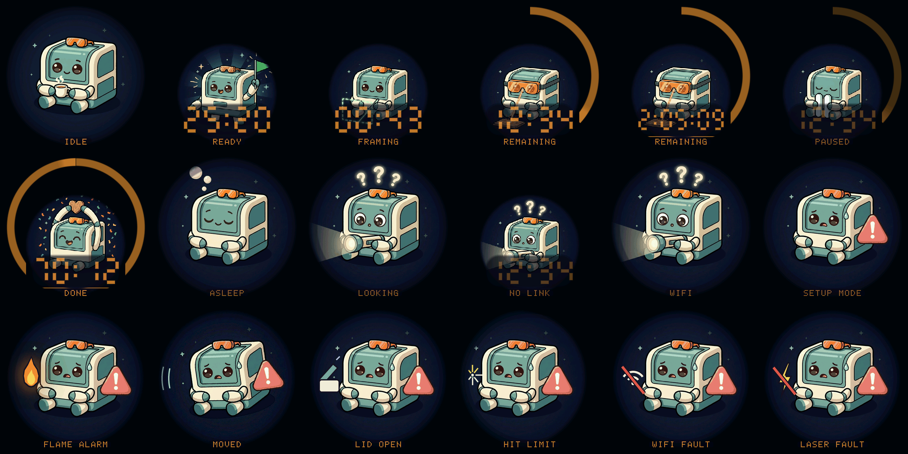

# xTool Buddy Orb

A palm-sized, **strictly read-only** status companion for the xTool S1 laser
cutter. A little illustrated buddy on a round display mirrors whatever the
laser is doing — searching, idle, sleeping, job ready, framing, cutting (with
progress ring and countdown), paused, finished, or unhappy — over your LAN,
with no cloud and no ability to control the machine.

<p align="center"></p>



*Host-rendered screens (pixel-exact: the preview tool runs the same drawing
code the firmware does). Top: idle, job ready, framing, cutting, long-job
countdown, paused. Middle: done, asleep, looking for the laser, link lost
mid-job (clock keeps running), no Wi-Fi, wifi-setup mode. Bottom, the error
family: flame alarm, moved, lid open, hit position limit, wifi-module fault,
laser-module fault.*

## Hardware

- **Guition JC3636W518C** — 1.8" round IPS 360×360, ESP32-S3R8 (16 MB flash /
  8 MB PSRAM), ST77916 panel over QSPI, CST816 touch, Qi wireless power.
  Pin map and board revision notes live in [`orb/board.h`](orb/board.h).
- An **xTool S1** on the same network. Other xTool models speak different
  protocols (see below) and would need their own link layer.

Tap the screen to toggle between bright and night-dim backlight.

## How it talks to the laser (and why it can't hurt it)

The S1 exposes a line-oriented M-code protocol over a plain WebSocket on port
8081, plus a UDP discovery service on port 20000 — all local, no auth. On
boot the orb broadcasts a discovery probe, learns the laser's IP, opens the
WebSocket, and polls the work state (`M222`) once a second, tracking elapsed
time itself and using the job-time push (`M815`) for countdowns when present.

**Read-only guarantee:** the only bytes the orb ever sends to the laser are
the documented read-only queries `M222` (work state) and `M2003` (device
info), plus WebSocket pong frames. There is no code path that can start,
stop, pause, or modify a job. Two known-dangerous codes (`M341 S1`, `M9006`)
are called out in [`orb/xtool_s1.h`](orb/xtool_s1.h) as never-send.

Quirks handled: the S1 serves **one** WebSocket client at a time — opening
xTool Creative Space evicts the orb (it shows NO LINK and quietly retakes the
slot when XCS lets go). Mid-job link loss keeps the clock running, because
the laser doesn't stop cutting just because we can't see it.

The protocol knowledge comes from community reverse engineering — chiefly
[thecodingdad/ha-xtool](https://github.com/thecodingdad/ha-xtool)'s
PROTOCOL.md, [1RandomDev/xTool-Connect](https://github.com/1RandomDev/xTool-Connect),
[BassXT/xtool](https://github.com/BassXT/xtool) and
[fritzw/xtm1_toolkit](https://github.com/fritzw/xtm1_toolkit) — verified live
against S1 firmware V40.32.013.

### State map

| S1 state (`M222 S<n>`) | Screen | Label |
|---|---|---|
| no Wi-Fi / laser not found | searching buddy | `WIFI` / `LOOKING` |
| ws lost during a job | searching buddy + clock | `NO LINK` |
| 1, 3 idle | tea break | `IDLE` |
| 17 sleeping | zzz | `ASLEEP` |
| 10, 24 measuring / 11, 13 job loaded | green flag | `MEASURING` / `READY` |
| 12 framing | dashed-box tracing + count-up | `FRAMING` |
| 14 processing | goggles + sparks, arc + countdown | `REMAINING` / `CUTTING` |
| 15 paused | pause bars, frozen clock, dimmed | `PAUSED` |
| 19 finished (held 60 s) | confetti + total time | `DONE` |
| 16 fw update / 18 cancelling | tea break | `UPDATING` / `STOPPING` |
| 2 wifi-setup | warning triangle | `SETUP MODE` |
| 9 flame detected | buddy + glowing flame | `FLAME ALARM` |
| 4 moved | tilted buddy, motion arcs | `MOVED` |
| 7 lid open | popped-lid box | `LID OPEN` |
| 20 hit limit | buddy shoved into the edge | `HIT LIMIT` |
| 21 wifi-module fault | slashed wifi symbol | `WIFI FAULT` |
| 22 laser-module fault | slashed bolt symbol | `LASER FAULT` |

Error meanings come from xTool's own support articles
([S7](https://support.xtool.com/article/1088),
[S9](https://support.xtool.com/article/1277),
[S20](https://support.xtool.com/article/1278),
[S21](https://support.xtool.com/article/1279)), so the orb names the fault
instead of showing a generic error — a tripped flame detector reads
`FLAME ALARM`.

## Building & flashing

Requires [arduino-cli](https://arduino.github.io/arduino-cli/) with the
`esp32:esp32` core and the Arduino_GFX library.

```sh
cd orb
cp secrets.h.example secrets.h   # fill in Wi-Fi + OTA password
./build.sh                        # compile
./build.sh flash                  # first flash, over USB (/dev/ttyACM0)
./build.sh ota                    # every flash after that, over Wi-Fi
./build.sh monitor                # serial log
```

ESP32-S3 flashing gotchas that cost us an evening once:

- If the unit looks bricked (black screen, no Wi-Fi, silent-but-present USB),
  it is probably just parked in ROM download mode. Probe with
  `esptool --before no_reset chip_id` — if it answers, it's in the bootloader.
- To force download mode: hold the K1/BOOT button **before** plugging USB in,
  keep holding ~3 s. USB descriptor errors (`error -71`) that persist even
  then are a bad cable, not firmware.
- esptool's plain RTS `hard_reset` may silently fail to reset the chip over
  the S3's native USB. `--after watchdog_reset` performs a real reset.
- Never let a sketch touch GPIO19/20 (native USB D−/D+).

`orb-diag/` is a minimal sketch that verifies the panel/touch wiring if you
suspect the hardware.

## The artwork pipeline

The nine core state illustrations are AI-generated (one anchor image of the
mascot, then every other state derived from it with the anchor as a style
reference, via OpenRouter). They're committed as palette-indexed bitmap
headers, so builds don't need any of this — but to regenerate or add states:

```sh
export OPENROUTER_API_KEY=...        # never committed
python3 orb/tools/gen_state_art.py all          # generate PNGs (1024²)
python3 orb/tools/prep_state_art.py in.png out.png   # 360², vignette, ≤248 colors
node orb/tools/build_face_bitmap.mjs out.png orb/art_<state>.h art_<state>
```

`orb/tools/preview_ui.cpp` renders every screen to raw RGB on the host using
the firmware's own drawing code — check layouts before flashing anything.
`orb/tools/decode_art.py` recovers a PNG (e.g. the `idle.png` style anchor
gen_state_art.py needs) from a committed header when the generated sources
are gone.

The six per-error avatars (`art_err_*.h`) are currently programmatic
derivations of the error art — same buddy, per-error pictogram composited on
top. `gen_state_art.py` already carries scene prompts for them, so
regenerating with the pipeline above swaps in fully illustrated versions.


## Repo layout

```
orb/            the firmware sketch
  orb.ino       screen selection + render loop + tap-to-dim
  xtool_s1.h    S1 discovery + WebSocket link (the read-only boundary)
  ui_buddy.h    drawing: art expansion, arc, 7-seg digits, label font
  art_*.h       generated state bitmaps (sources in assets/states/)
  board.h       hardware pin map & revision notes
  tools/        art pipeline + host preview
orb-diag/       hardware bring-up / wiring diagnostic sketch
docs/           screenshots for this README
```
